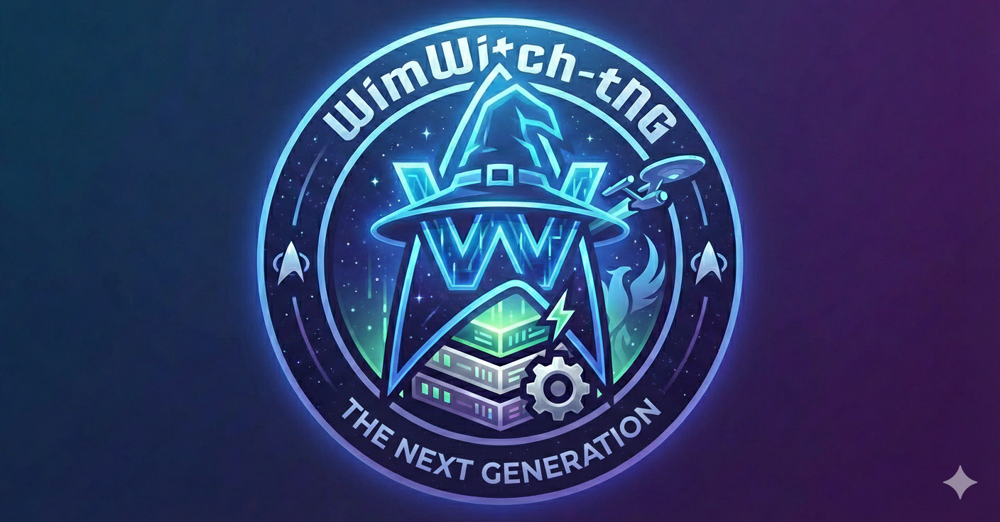

# WIMWitch-tNG

_"Make it so." - Captain Jean-Luc Picard_



## Overview

WIMWitch-tNG (the Next Generation) is a community-maintained fork of WIMWitch by Donna Ryan (TheNotoriousDRR), which reached end-of-life in January 2023. The project is actively developed to keep the tool alive and leverage community contributions for maintenance and feature enhancements.

**What is WIMWitch-tNG?**

A comprehensive PowerShell module and GUI application for Windows installation image (WIM file) customization. It provides:

- **Graphical Interface:** Interactive image customization via Windows Forms
- **Automation Support:** Configuration file-driven workflows for CI/CD integration
- **Integration Capabilities:** Windows Update, ConfigMgr, Autopilot, Google Workspace
- **Image Customization:** Driver injection, application removal, language packs, Feature on Demand (FOD) management
- **ISO Creation:** Generate bootable Windows installation media

**About the Name:** The "tNG" (the Next Generation) suffix honors Donna Ryan's original Star Trek: The Next Generation theme. Like Captain Picard's Enterprise-D, WIMWitch-tNG represents an evolution of its predecessor while staying true to the original mission: "to boldly go where no image customization tool has gone before."

---

## Requirements & Compatibility

- **PowerShell:** 5.1 or higher (Windows-based or PowerShell Core/7+ on macOS/Linux for module import)
- **Windows:** Target systems must be Windows 10 or newer
- **Permissions:** Administrator privileges required for image customization operations

---

## Getting Started

### Installation

Clone the repository and import the module:

```powershell
git clone https://github.com/alaurie/WimWitchFK.git
cd WimWitchFK
Import-Module ./WIMWitch-tNG/WIMWitch-tNG.psd1
```

### Usage

**Interactive GUI:**

```powershell
Invoke-WimWitchTng
```


**Command-line with configuration file:**

```powershell
Invoke-WimWitchTng -ConfigFile "path/to/config.json"
```

**Backward-compatibility alias:**

```powershell
Invoke-WIMWitch-tNG  # Works with both naming conventions
```

---

## Project Structure

```text
WimWitch-tNG/
├── WIMWitch-tNG/
│   ├── Public/                 # Public functions (API)
│   ├── Private/
│   │   ├── Functions/          # 105 modularized private functions
│   │   │   ├── Administrative/
│   │   │   ├── AppX/
│   │   │   ├── Autopilot/
│   │   │   ├── BootWIM/
│   │   │   ├── ConfigMgr/
│   │   │   ├── Configuration/
│   │   │   ├── DotNetOneDrive/
│   │   │   ├── Drivers/
│   │   │   ├── ISO/
│   │   │   ├── LanguagePacksFOD/
│   │   │   ├── Logging/
│   │   │   ├── Registry/
│   │   │   ├── UI/
│   │   │   ├── Updates/
│   │   │   ├── Utilities/
│   │   │   └── WIMOperations/
│   │   └── Assets/             # AppX removal lists (Windows 10/11 versions)
│   ├── WIMWitch-tNG.psd1       # Module manifest
│   └── WIMWitch-tNG.psm1       # Module definition
├── tools/                      # Development and utility scripts
├── docs/                       # Documentation
├── .github/
│   ├── prompts/                # Implementation plans & governance
│   └── ADRs/                   # Architectural Decision Records
├── PROJECT_CONTEXT.md          # AI development guide
├── CHANGELOG.md                # Comprehensive version history
└── README.md                   # This file
```


---

## Documentation

Comprehensive documentation is available:

- **[PROJECT_CONTEXT.md](PROJECT_CONTEXT.md)** — Architecture, coding standards, function reference, and AI development guide (1,300+ lines)
- **[CHANGELOG.md](CHANGELOG.md)** — Complete version history, current status, and planned features
- **[STANDARDS_CORE.md](STANDARDS_CORE.md)** — Universal coding principles
- **[STANDARDS_POWERSHELL.md](STANDARDS_POWERSHELL.md)** — PowerShell-specific standards
- **[WIMWitch-tNG/Private/README-Functions.md](WIMWitch-tNG/Private/README-Functions.md)** — Function directory and index


---

## Current Version

**Version:** 5.0-beta (released January 19, 2026)

**Current Status:** Pre-release focused on comprehensive documentation and code infrastructure

**Key Achievements:**

- ✅ All 105 private functions modularized into organized subdirectories
- ✅ Complete code documentation with comment-based help for all functions
- ✅ Comprehensive PROJECT_CONTEXT.md for AI-assisted development
- ✅ Full CHANGELOG.md with planned features and bug fixes
- ✅ Code signature blocks added to all PowerShell files
- ✅ Governance framework (PERSONA, SPEC_PROTOCOL, STANDARDS)

**Versioning Strategy:**

- **Current:** 5.0-beta (pre-release, documentation milestone)
- **Next:** Date-based versioning (YYYY.M.D format)
  - Example: 2026.1.1 = January 2026, first stable release
  - Benefits: Clear release timing, easier maintenance tracking


---

## Development & Contributing

See [CHANGELOG.md](CHANGELOG.md) for planned features, known bugs, and implementation status.

For development guidelines, see [STANDARDS_CORE.md](STANDARDS_CORE.md) and [STANDARDS_POWERSHELL.md](STANDARDS_POWERSHELL.md).

---

## Changelog

For the complete version history, see [CHANGELOG.md](CHANGELOG.md).

### 5.0-beta (2026-01-19)

**Major Infrastructure:**

- Modularized 105 private functions from monolithic WWFunctions.ps1 into organized categories
- Complete code documentation: All 111 functions now include comprehensive comment-based help
- PROJECT_CONTEXT.md: 1,300+ line AI development guide
- CHANGELOG.md: Comprehensive tracking of all changes, planned features, and bug fixes
- Governance framework: PERSONA, SPEC_PROTOCOL, STANDARDS, CONSENT_CHECKLIST
- Code signature blocks added to all PowerShell files


### 4.0.1

- Resolved issue with default paths in Make It So tab

### 4.0.0

- Refactored script into a PowerShell module
- Added Assets directory and moved appx removal definitions to data files
- Added WorkingDirectory parameter; refactored all functions to use it
- Added new icon

---

## License

See [LICENSE](LICENSE) file for details.

---

## Credits

- **Original Author:** Donna Ryan (TheNotoriousDRR)
- **Original Repository:** [WimWitchFK](https://github.com/alaurie/WimWitchFK)
- **Current Maintainer:** Eden Nelson
- **Contributors:** Alex Laurie, and the community

---

## Support & Feedback

For issues, feature requests, and discussions, please use the GitHub repository: [github.com/alaurie/WimWitchFK](https://github.com/alaurie/WimWitchFK)
